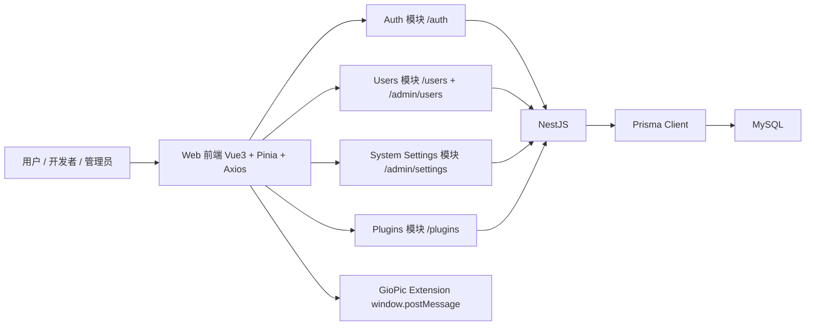

# FileUp 后端基线架构（M1）

本模块是 `docs/serve` 的统一基线文档，所有业务模块（管理员后台、版本管理、评价系统、账号与系统设置、数据库迁移）都以这里定义为准。

## 1. 文档范围

覆盖代码范围：

- `server/src/main.ts`
- `server/src/auth/*`
- `server/src/users/*`
- `server/src/system-settings/*`
- `server/src/plugins/*`
- `server/src/prisma/*`
- `server/prisma/schema.prisma`
- `server/prisma/migrations/*`
- `web/fileup.dev/src/common/services/api.ts`
- `web/fileup.dev/src/frontend/pages/*`
- `web/fileup.dev/src/backstage/pages/*`
- `web/fileup.dev/src/homepage/pages/*`

## 2. 系统分层

## 3. 运行时与部署约定

### 3.1 后端运行时

- 全局前缀：`/api`（`app.setGlobalPrefix('api')`）
- CORS：`enableCors()` 全开
- BigInt 序列化：统一转 `Number`
- 端口：`process.env.PORT ?? 3000`

### 3.2 前端 API 基地址

- 前端默认：`http://127.0.0.1:3000/api`
- 来源：`src/common/services/api.ts` 的 `API_BASE_URL`

### 3.3 关键环境变量

| 变量 | 用途 |
| --- | --- |
| `DATABASE_URL` | MySQL 连接串（Prisma MariaDB Adapter） |
| `JWT_SECRET` | JWT 签名密钥 |
| `FRONTEND_URL` | OAuth 回跳、验证邮件链接、重置密码链接的前端域名 |
| `BACKEND_PUBLIC_URL` | 生成 OAuth（GitHub/Google）绑定授权地址时使用的后端公开地址 |
| `GITHUB_CLIENT_ID` / `GITHUB_CLIENT_SECRET` / `GITHUB_CALLBACK_URL` | GitHub OAuth |
| `GOOGLE_CLIENT_ID` / `GOOGLE_CLIENT_SECRET` / `GOOGLE_CALLBACK_URL` | Google OAuth |
| `SETTINGS_ENCRYPTION_KEY` | 系统配置密文加解密密钥（32-byte base64 或 64-char hex） |
| `EMAIL_VERIFY_TOKEN_TTL_MINUTES` | 邮箱验证码/链接有效期（默认 30 分钟） |
| `EMAIL_VERIFY_RESEND_COOLDOWN_SECONDS` | 验证邮件重发冷却（默认 60 秒） |
| `PASSWORD_RESET_TOKEN_TTL_MINUTES` | 管理员密码重置链接有效期（默认 30 分钟） |
| `PORT` | 服务监听端口 |

## 4. 数据模型（Prisma）

## 4.1 User（账号核心）

核心字段：

- 身份：`id`、`username`、`displayName`、`avatar`、`bio`
- 权限：`role`（`DEVELOPER` / `ADMIN`）
- 状态：`status`（`ACTIVE` / `DISABLED`）
- 认证：`githubId`（兼容遗留）、`oauthAccounts[]`、`email`、`passwordHash`
- 验证链路：`emailVerifiedAt`、`emailVerifyRequired`、`lastVerificationSentAt`
- 待确认链路：`pendingEmail`、`pendingEmailPurpose`（`EMAIL_CHANGE` / `LOCAL_BIND`）、`pendingPasswordHash`
- 安全与审计：`adminNote`、`lastLoginAt`、`passwordUpdatedAt`

对外状态映射（服务层）：

- `ACTIVE`：账号可用且已完成验证策略
- `PENDING`：`status=ACTIVE` 且 `emailVerifyRequired=true` 且 `emailVerifiedAt is null`
- `BANNED`：`status=DISABLED`

## 4.2 账号安全相关模型

### EmailVerificationToken

- 用途：注册验证、改绑邮箱验证、OAuth 账号本地绑定验证
- 关键字段：`purpose`（`REGISTER` / `EMAIL_CHANGE` / `LOCAL_BIND`）、`tokenHash`、`codeHash`、`expiresAt`、`consumedAt`

### UserOAuthAccount

- 用途：统一管理第三方登录身份（`GITHUB` / `GOOGLE`）
- 关键字段：`provider`、`providerUserId`、`providerEmail`、`isActive`、`unboundAt`
- 关键约束：`(provider, providerUserId)` 唯一、`(provider, userId)` 唯一
- 状态语义：解绑不会删记录，而是将 `isActive=false` 并记录 `unboundAt`，用于后续恢复绑定

### PasswordResetToken

- 用途：管理员发起密码重置链接
- 关键字段：`tokenHash`、`expiresAt`、`consumedAt`、`createdByAdminId`

### AdminUserActionLog

- 用途：管理员用户治理审计
- `action`：`UPDATE_PROFILE` / `UPDATE_ROLE` / `UPDATE_STATUS` / `RESEND_VERIFICATION` / `RESET_PASSWORD` / `FORCE_UNBIND_OAUTH`

## 4.3 系统配置模型

### SystemMailConfig

- 单例配置（`id='default'`）
- 保存 SMTP 主机、端口、账户、发件人、启用状态
- 密码仅存 `smtpPassEncrypted`（明文由 `SecretCryptoService` 解密使用）

### SystemCaptchaConfig

- 单例配置（`id='default'`）
- 提供 `TURNSTILE` / `RECAPTCHA`、启用开关、登录/注册场景开关、评分阈值
- 密钥仅存 `secretEncrypted`

### SystemConfigAuditLog

- 系统配置操作审计日志
- `category`：`MAIL` / `CAPTCHA`

## 4.4 插件域模型（摘要）

### Plugin

- 摘要层：`id`、`authorId`、`name/description/icon`
- 运营层：`isPublic`、`adminDisabled`、`downloads`
- 版本治理：`activeVersionId`、`lastVersionActionAt`

### PluginVersion

- `pluginId + version` 唯一
- `content` 为完整安装载荷
- `status`：`PENDING` / `APPROVED` / `REJECTED`
- `deletedAt/deletedById/deleteReason` 软删除链路

### PluginVersionActionLog / PluginReview / PluginReviewReply / PluginDownload

- 版本动作审计、评价闭环、下载去重计数（IP 10 秒窗口）

## 5. 统一接口契约（后端真实实现）

## 5.1 认证与会话

| 前端调用 | 后端路由 | 权限 | 说明 |
| --- | --- | --- | --- |
| `GET /auth/github` | `GET /api/auth/github` | 公开 | 发起 GitHub OAuth |
| `GET /auth/google` | `GET /api/auth/google` | 公开 | 发起 Google OAuth |
| `POST /auth/github/bind` | `POST /api/auth/github/bind` | JWT | 生成 GitHub 绑定授权地址（含短期 `state`） |
| `POST /auth/google/bind` | `POST /api/auth/google/bind` | JWT | 生成 Google 绑定授权地址（含短期 `state`） |
| `GET /auth/github/callback` | `GET /api/auth/github/callback` | 公开 | 登录回调或绑定回调（依据 `state`） |
| `GET /auth/google/callback` | `GET /api/auth/google/callback` | 公开 | 登录回调或绑定回调（依据 `state`） |
| `POST /auth/register` | `POST /api/auth/register` | 公开 | 本地账号注册（支持验证码策略） |
| `POST /auth/login` | `POST /api/auth/login` | 公开 | 用户名或邮箱 + 密码登录 |
| `GET /auth/email/verify` | `GET /api/auth/email/verify` | 公开 | 邮箱 token 验证并签发 JWT |
| `POST /auth/email/verify-code` | `POST /api/auth/email/verify-code` | 公开 | 邮箱 code 验证并签发 JWT |
| `POST /auth/email/resend` | `POST /api/auth/email/resend` | 公开 | 重发注册验证邮件 |
| `POST /auth/password-reset/confirm` | `POST /api/auth/password-reset/confirm` | 公开 | 使用 reset token 完成改密 |
| `GET /auth/captcha/config` | `GET /api/auth/captcha/config` | 公开 | 获取前端可见验证码策略 |
| `GET /auth/me` | `GET /api/auth/me` | JWT | 获取当前登录态（含 `authProvider/accountType/authProviders`、验证状态） |

## 5.2 用户自助账号管理

| 前端调用 | 后端路由 | 权限 | 说明 |
| --- | --- | --- | --- |
| `GET /users/me/profile` | `GET /api/users/me/profile` | JWT | 我的资料详情 |
| `PATCH /users/me/profile` | `PATCH /api/users/me/profile` | JWT | 更新昵称、头像、简介、用户名 |
| `PATCH /users/me/password` | `PATCH /api/users/me/password` | JWT | 修改密码（LOCAL / MIXED 需校验旧密码） |
| `POST /users/me/email-change/request` | `POST /api/users/me/email-change/request` | JWT | 发起改绑邮箱并发送验证邮件 |
| `POST /users/me/email-change/resend` | `POST /api/users/me/email-change/resend` | JWT | 重发改绑邮箱验证 |
| `POST /users/me/local-bind/request` | `POST /api/users/me/local-bind/request` | JWT | OAuth 账号（GitHub/Google）发起本地密码绑定 |
| `POST /users/me/local-bind/resend` | `POST /api/users/me/local-bind/resend` | JWT | 重发本地绑定验证 |
| `POST /users/me/resend-verification` | `POST /api/users/me/resend-verification` | JWT | 重发当前邮箱验证 |
| `DELETE /users/me/oauth/:provider` | `DELETE /api/users/me/oauth/:provider` | JWT | 解绑当前用户第三方登录（`github/google`） |

## 5.3 管理员用户治理

| 前端调用 | 后端路由 | 权限 | 说明 |
| --- | --- | --- | --- |
| `GET /admin/users` | `GET /api/admin/users` | JWT + ADMIN | 用户分页检索（`keyword/role/status/page/pageSize`） |
| `GET /admin/users/:id` | `GET /api/admin/users/:id` | JWT + ADMIN | 用户详情 |
| `PATCH /admin/users/:id` | `PATCH /api/admin/users/:id` | JWT + ADMIN | 管理员编辑用户资料/邮箱/备注 |
| `PATCH /admin/users/:id/role` | `PATCH /api/admin/users/:id/role` | JWT + ADMIN | 切换角色（带最后管理员保护） |
| `PATCH /admin/users/:id/status` | `PATCH /api/admin/users/:id/status` | JWT + ADMIN | 封禁/解封（`ACTIVE`/`BANNED`） |
| `POST /admin/users/:id/password-reset` | `POST /api/admin/users/:id/password-reset` | JWT + ADMIN | 管理员重置密码（`LINK` / `TEMP_PASSWORD`） |
| `POST /admin/users/:id/resend-verification` | `POST /api/admin/users/:id/resend-verification` | JWT + ADMIN | 管理员代发验证邮件 |
| `DELETE /admin/users/:id/oauth/:provider` | `DELETE /api/admin/users/:id/oauth/:provider` | JWT + ADMIN | 管理员强制解绑第三方登录（`github/google`） |

兼容旧接口（仍保留）：

- `GET /api/users/admin/list`
- `PATCH /api/users/:id/role`

## 5.4 系统设置

| 前端调用 | 后端路由 | 权限 | 说明 |
| --- | --- | --- | --- |
| `GET /admin/settings/mail` | `GET /api/admin/settings/mail` | JWT + ADMIN | 读取邮件配置（不回传明文密码） |
| `PATCH /admin/settings/mail` | `PATCH /api/admin/settings/mail` | JWT + ADMIN | 更新邮件配置 |
| `POST /admin/settings/mail/test` | `POST /api/admin/settings/mail/test` | JWT + ADMIN | 发送测试邮件并写审计日志 |
| `GET /admin/settings/captcha` | `GET /api/admin/settings/captcha` | JWT + ADMIN | 读取验证码配置 |
| `PATCH /admin/settings/captcha` | `PATCH /api/admin/settings/captcha` | JWT + ADMIN | 更新验证码配置 |

## 5.5 插件核心

| 前端调用 | 后端路由 | 权限 | 说明 |
| --- | --- | --- | --- |
| `GET /plugins` | `GET /api/plugins` | 公开 | 默认返回公开且可展示的 APPROVED 版本 |
| `GET /plugins?status=PENDING` | `GET /api/plugins?status=PENDING` | 公开 | 按状态筛（非 APPROVED 分支） |
| `GET /plugins/:id` | `GET /api/plugins/:id` | 公开 | 返回单插件 + 展示版本 |
| `GET /plugins/:id?allStatus=true` | `GET /api/plugins/:id?allStatus=true` | 公开 | 返回最新任意状态版本 |
| `POST /plugins/:id/download` | `POST /api/plugins/:id/download` | 公开 | 下载计数（10 秒 IP 去重） |
| `POST /plugins` | `POST /api/plugins` | JWT | 提交新插件或新版本（新版本状态=PENDING） |
| `GET /plugins/my` | `GET /api/plugins/my` | JWT | 我的插件 |
| `GET /plugins/pending` | `GET /api/plugins/pending` | JWT + ADMIN | 待审核列表 |
| `GET /plugins/admin/all` | `GET /api/plugins/admin/all` | JWT + ADMIN | 管理员全量插件 |
| `PATCH /plugins/:id/versions/:version/audit` | `PATCH /api/plugins/:id/versions/:version/audit` | JWT + ADMIN | 版本审核 |
| `PATCH /plugins/:id/visibility` | `PATCH /api/plugins/:id/visibility` | JWT + 作者/管理员 | 上下架 + 管理员强制下架模式 |
| `DELETE /plugins/:id` | `DELETE /api/plugins/:id` | JWT + ADMIN | 删除插件（级联） |

## 5.6 版本治理

| 前端调用 | 后端路由 | 权限 | 说明 |
| --- | --- | --- | --- |
| `GET /plugins/:id/versions` | `GET /api/plugins/:id/versions` | JWT + 作者/管理员 | 版本列表（可带 `includeDeleted=true`） |
| `PATCH /plugins/:id/versions/:version/rollback` | `PATCH /api/plugins/:id/versions/:version/rollback` | JWT + 作者/管理员 | 回滚生效版本 |
| `DELETE /plugins/:id/versions/:version` | `DELETE /api/plugins/:id/versions/:version` | JWT + 作者/管理员 | 软删除版本（`reason` query） |
| `GET /plugins/:id/versions/actions` | `GET /api/plugins/:id/versions/actions` | JWT + 作者/管理员 | 版本动作日志 |

## 5.7 评价系统

| 前端调用 | 后端路由 | 权限 | 说明 |
| --- | --- | --- | --- |
| `GET /plugins/:id/reviews` | `GET /api/plugins/:id/reviews` | 公开 | 评价列表 + 汇总 + 回复 |
| `POST /plugins/:id/reviews` | `POST /api/plugins/:id/reviews` | JWT | 发表评价（同用户对同插件仅一条） |
| `PATCH /plugins/:id/reviews/:reviewId/reply` | `PATCH /api/plugins/:id/reviews/:reviewId/reply` | JWT + 作者/管理员 | 追加回复 |
| `DELETE /plugins/:id/reviews/:reviewId` | `DELETE /api/plugins/:id/reviews/:reviewId` | JWT + ADMIN | 删除评价 |

## 6. 页面耦合矩阵

| 前端页面 | 主调用接口 | 关键字段耦合 |
| --- | --- | --- |
| `LoginView.vue` / `RegisterView.vue` | `/auth/login`、`/auth/register`、`/auth/captcha/config`、`/auth/github`、`/auth/google` | `captchaToken`、`access_token`、OAuth 跳转 |
| `VerifyEmailView.vue` / `ResetPasswordView.vue` | `/auth/email/verify*`、`/auth/password-reset/confirm` | `token/code`、验证后会话 |
| `ProfileSettings.vue` / `SecuritySettings.vue` | `/users/me/*`、`/auth/me`、`/auth/*/bind` | `authProvider`、`authProviders[]`、`status`、`pendingEmailPurpose` |
| `PluginMarketplace.vue` | `/plugins`、`/plugins/:id/reviews*`、`/plugins/:id/download` | `versions[0].content`、`author.username/avatar`、`downloads` |
| `SubmitPlugin.vue` | `GET /plugins/:id?allStatus=true`、`POST /plugins` | 表单字段 <-> `content` 双向同步 |
| `Dashboard.vue` | `/plugins/my`、`/plugins/:id/versions*` | 版本治理、状态标签、活跃版本 |
| `AdminReview.vue` + `/backstage/pages/*` | `/plugins/*`、`/admin/users/*`、`/admin/settings/*` | 审核、运营、账号治理、系统配置 |

## 7. 当前边界与风险（事实层）

1. `enableCors()` 为全开放策略。
2. 邮件与验证码能力依赖管理员配置；`SETTINGS_ENCRYPTION_KEY` 缺失会导致系统配置密文不可用。
3. `GET /plugins` 的 `status` 非 APPROVED 查询对外公开；`GET /plugins/:id?allStatus=true` 也是公开路径。
4. 插件列表/搜索/排序/分页主要在前端完成，后端未提供通用分页参数。
5. 评价读写使用了原生 SQL（`$queryRaw/$executeRaw`），需关注 SQL 维护成本。
6. 密码重置链接有效期可配置，但当前未实现专门的节流与风控策略。
7. 管理员操作日志（`AdminUserActionLog`）已入库，但暂未提供独立查询接口给前端。
8. OAuth 身份处于兼容期：`User.githubId` 与 `UserOAuthAccount` 双源并存，迁移/回填不完整会导致账号归并异常。
9. OAuth 解绑为“软解绑”（`isActive=false`），若前端未处理 `USER_OAUTH_UNBOUND_REBIND_REQUIRED`，用户可能误以为第三方登录失效。

## 8. 模块关系

- 管理员后台细节：`admin_console_redesign.md`
- 版本治理细节：`plugin_version_management.md`
- 评价闭环细节：`plugin_review_system.md`
- 市场通讯协议细节：`plugin_market_api.md`
- 账号与系统设置细节：`auth_account_system_settings.md`
- 数据库迁移细节：`database_migrations_20260309.md`
