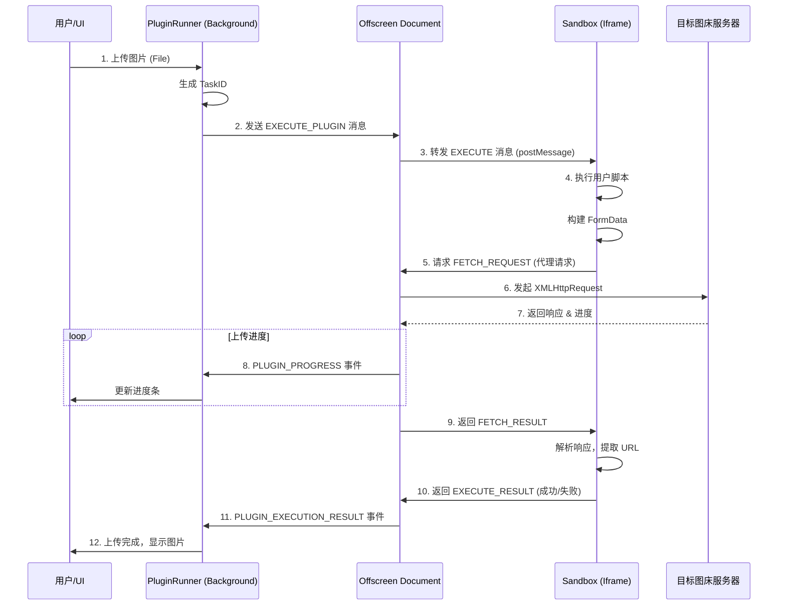

# GioPic 插件系统架构解析

本文档详细介绍了 GioPic 基于 Manifest V3 的安全插件执行环境架构。该架构利用 **Offscreen Document** 和 **Sandbox** 技术，实现了不可信代码的安全隔离执行与跨域请求代理。

## 目录结构概览

```
src/
├── offscreen/              # 离屏文档 (中转站)
│   ├── offscreen.html      # 承载 Offscreen 的 HTML 容器
│   └── offscreen.ts        # 负责消息路由、Sandbox 管理、代理请求
│
├── sandbox/                # 安全沙箱 (执行环境)
│   ├── index.html          # 承载 iframe 的 HTML 容器
│   └── sandbox.ts          # 负责执行用户脚本、序列化请求
│
└── services/
    └── pluginRunner.ts     # 插件调度器 (入口)
```

---

## 核心模块详解

### 1. Plugin Runner (`src/services/pluginRunner.ts`)

**角色**: 调度器 (Scheduler)

这是插件系统的入口点，运行在扩展的 Background Service Worker 中。

*   **生命周期管理**: 负责创建和销毁 Offscreen Document。
*   **健康检查**: 通过 `PING/PONG` 机制检测 Offscreen 环境是否就绪，并在无响应时自动重启环境。
*   **任务分发**: 将用户上传操作封装为 `EXECUTE_PLUGIN` 消息，发送给 Offscreen。
*   **事件驱动**: 使用 `taskId` 跟踪异步任务，监听 `PLUGIN_EXECUTION_RESULT` 和 `PLUGIN_PROGRESS` 事件。

### 2. Offscreen Document (`src/offscreen/`)

**角色**: 中转代理 (Broker & Proxy)

由于 Manifest V3 的 Service Worker 无法直接访问 DOM (也就无法创建 iframe 沙箱)，我们需要一个 Offscreen Document 作为桥梁。

#### `offscreen.html`
一个包含 `iframe` 的简单 HTML 页面：
```html
<iframe id="sandbox-frame" src="../sandbox/index.html" sandbox="allow-scripts"></iframe>
```
它加载了沙箱环境。

#### `offscreen.ts`
运行在 Offscreen 页面中的脚本，拥有 DOM 访问权限和完整的 Chrome API 访问权限。

*   **消息路由**: 接收来自 Background 的 `EXECUTE_PLUGIN` 消息，并通过 `postMessage` 转发给 Sandbox iframe。
*   **网络代理 (Proxy Fetch)**:
    *   Sandbox 受限于安全策略无法直接发起跨域请求。
    *   Offscreen 接收来自 Sandbox 的 `FETCH_REQUEST`。
    *   使用 `XMLHttpRequest` (为了支持进度条) 发起真实网络请求。
    *   支持 `FormData` 的自动重建（解决 `postMessage` 无法传输 FormData 的问题）。
*   **结果回传**: 将执行结果或进度信息通过 `chrome.runtime.sendMessage` 主动推送到 Background。

### 3. Sandbox (`src/sandbox/`)

**角色**: 执行环境 (Execution Environment)

这是唯一执行用户提供的不可信代码 (User Script) 的地方。

#### `index.html`
一个纯净的 HTML 页面，作为沙箱容器。

#### `sandbox.ts`
沙箱内的宿主脚本。

*   **代码求值**: 使用 `new Function(script)` 安全地解析用户脚本。
*   **上下文注入**: 向用户脚本注入 `ctx` 对象（包含 `fetch` 代理方法）。
*   **请求序列化**: 拦截用户脚本发起的请求，将 `FormData` 等复杂对象序列化为可传输的格式。
*   **通信**: 通过 `window.parent.postMessage` 与外部 (Offscreen) 通信。

---

## 数据流向图



## 安全性设计

1.  **代码隔离**: 用户代码仅在 `sandbox` 属性限制的 iframe 中运行，无法访问扩展的 Cookie、Storage 或 Chrome API。
2.  **网络隔离**: Sandbox 内部无法直接发起网络请求，必须通过 Offscreen 代理，确保请求受到扩展权限的管控。
3.  **序列化检查**: `FormData` 的序列化机制避免了恶意代码通过构造特殊对象攻击 `postMessage` 通道。
4.  **超时熔断**: PluginRunner 设置了 30秒 强制超时，防止恶意脚本死循环导致扩展卡死。
